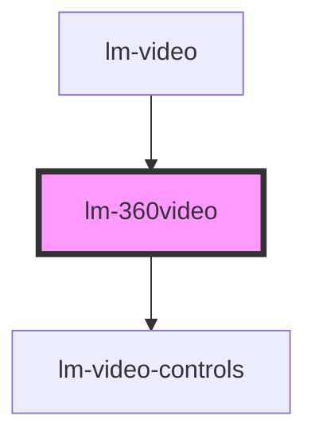

# lm-360video

<!-- Auto Generated Below -->

## Properties

| Property              | Attribute               | Description | Type            | Default     |
| --------------------- | ----------------------- | ----------- | --------------- | ----------- |
| `id`                  | `id`                    |             | `string`        | `""`        |
| `parent`              | --                      |             | `ISceneElement` | `undefined` |
| `position`            | `position`              |             | `string`        | `undefined` |
| `sceneElement`        | --                      |             | `LM360Video`    | `undefined` |
| `sequenceNo`          | `sequence-no`           |             | `number`        | `undefined` |
| `shadowsEnabled`      | `shadows-enabled`       |             | `boolean`       | `true`      |
| `src`                 | `src`                   |             | `string`        | `undefined` |
| `videoHeightSegments` | `video-height-segments` |             | `number`        | `40`        |
| `videoRadius`         | `video-radius`          |             | `number`        | `600`       |
| `videoWidthSegments`  | `video-width-segments`  |             | `number`        | `60`        |
| `vrEnabled`           | `vr-enabled`            |             | `boolean`       | `true`      |

## Events

| Event               | Description | Type                         |
| ------------------- | ----------- | ---------------------------- |
| `addElementToRoot`  |             | `CustomEvent<ISceneElement>` |
| `click`             |             | `CustomEvent<any>`           |
| `hideCurrentLayout` |             | `CustomEvent<any>`           |
| `showCurrentLayout` |             | `CustomEvent<any>`           |
| `viewCurrentLayout` |             | `CustomEvent<any>`           |

## Methods

### `close() => Promise<void>`

#### Returns

Type: `Promise<void>`

### `destroy() => Promise<void>`

#### Returns

Type: `Promise<void>`

### `pause() => Promise<void>`

#### Returns

Type: `Promise<void>`

### `play() => Promise<void>`

#### Returns

Type: `Promise<void>`

### `reset() => Promise<void>`

#### Returns

Type: `Promise<void>`

## Dependencies

### Used by

 - [lm-video](../lm-video)

### Depends on

- [lm-video-controls](../lm-video-controls)

### Graph

----------------------------------------------

*Built with [StencilJS](https://stenciljs.com/)*
