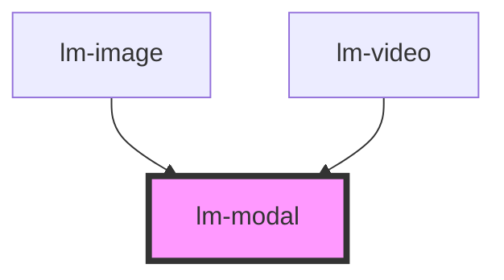

# lm-modal

<!-- Auto Generated Below -->

## Properties

| Property           | Attribute            | Description | Type            | Default     |
| ------------------ | -------------------- | ----------- | --------------- | ----------- |
| `backgroundColor`  | `background-color`   |             | `string`        | `"#222222"` |
| `borderColor`      | `border-color`       |             | `string`        | `"#ffffff"` |
| `borderRadius`     | `border-radius`      |             | `number`        | `0`         |
| `borderWidth`      | `border-width`       |             | `number`        | `0`         |
| `closeButtonWidth` | `close-button-width` |             | `number`        | `50`        |
| `height`           | `height`             |             | `number`        | `undefined` |
| `id`               | `id`                 |             | `string`        | `""`        |
| `offset`           | `offset`             |             | `number`        | `100`       |
| `padding`          | `padding`            |             | `number`        | `10`        |
| `parent`           | --                   |             | `ISceneElement` | `undefined` |
| `position`         | `position`           |             | `string`        | `undefined` |
| `sceneElement`     | --                   |             | `LMModal`       | `undefined` |
| `shadowsEnabled`   | `shadows-enabled`    |             | `boolean`       | `true`      |
| `vrEnabled`        | `vr-enabled`         |             | `boolean`       | `true`      |
| `width`            | `width`              |             | `number`        | `1000`      |

## Events

| Event              | Description | Type                         |
| ------------------ | ----------- | ---------------------------- |
| `addElementToRoot` |             | `CustomEvent<ISceneElement>` |
| `click`            |             | `CustomEvent<any>`           |
| `hidden`           |             | `CustomEvent<any>`           |
| `shown`            |             | `CustomEvent<any>`           |

## Methods

### `destroy() => Promise<void>`

#### Returns

Type: `Promise<void>`

### `getUUID() => Promise<string>`

#### Returns

Type: `Promise<string>`

### `hide() => Promise<void>`

#### Returns

Type: `Promise<void>`

### `show() => Promise<void>`

#### Returns

Type: `Promise<void>`

## Dependencies

### Used by

 - [lm-image](../lm-image)
 - [lm-video](../lm-video)

### Graph

----------------------------------------------

*Built with [StencilJS](https://stenciljs.com/)*
