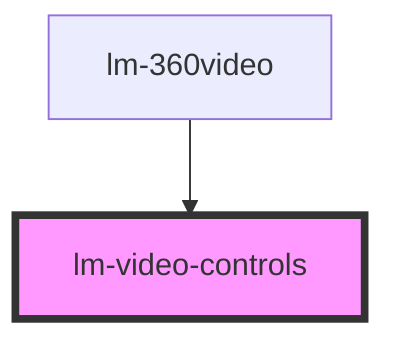

# lm-video-controls

<!-- Auto Generated Below -->

## Properties

| Property          | Attribute          | Description | Type            | Default     |
| ----------------- | ------------------ | ----------- | --------------- | ----------- |
| `backgroundColor` | `background-color` |             | `string`        | `"#333333"` |
| `height`          | `height`           |             | `number`        | `30`        |
| `id`              | `id`               |             | `string`        | `""`        |
| `onClose`         | --                 |             | `Function`      | `undefined` |
| `onPause`         | --                 |             | `Function`      | `undefined` |
| `onPlay`          | --                 |             | `Function`      | `undefined` |
| `parent`          | --                 |             | `ISceneElement` | `undefined` |
| `position`        | `position`         |             | `string`        | `undefined` |
| `sequenceNo`      | `sequence-no`      |             | `number`        | `undefined` |
| `shadowsEnabled`  | `shadows-enabled`  |             | `boolean`       | `true`      |
| `vrEnabled`       | `vr-enabled`       |             | `boolean`       | `true`      |
| `width`           | `width`            |             | `number`        | `75`        |
| `x`               | `x`                |             | `number`        | `0`         |
| `y`               | `y`                |             | `number`        | `10`        |
| `z`               | `z`                |             | `number`        | `300`       |

## Events

| Event                       | Description | Type                         |
| --------------------------- | ----------- | ---------------------------- |
| `addElementToRoot`          |             | `CustomEvent<ISceneElement>` |
| `updateRootElementPosition` |             | `CustomEvent<ISceneElement>` |

## Methods

### `getVisible() => Promise<boolean>`

#### Returns

Type: `Promise<boolean>`

### `hide() => Promise<void>`

#### Returns

Type: `Promise<void>`

### `show(isPlaying: boolean) => Promise<void>`

#### Returns

Type: `Promise<void>`

## Dependencies

### Used by

 - [lm-360video](../lm-360video)

### Graph

----------------------------------------------

*Built with [StencilJS](https://stenciljs.com/)*
