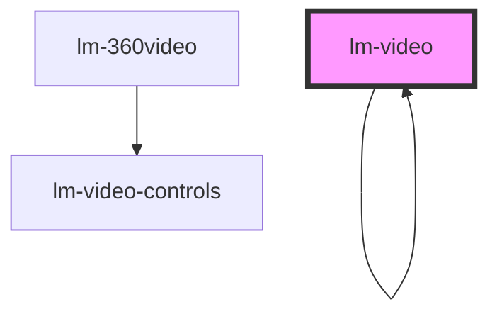

# lm-video

<!-- Auto Generated Below -->

## Properties

| Property         | Attribute         | Description | Type            | Default     |
| ---------------- | ----------------- | ----------- | --------------- | ----------- |
| `height`         | `height`          |             | `number`        | `undefined` |
| `id`             | `id`              |             | `string`        | `""`        |
| `offset`         | `offset`          |             | `number`        | `undefined` |
| `parent`         | --                |             | `ISceneElement` | `undefined` |
| `placeholder`    | `placeholder`     |             | `number`        | `0.1`       |
| `playback`       | `playback`        |             | `string`        | `"inline"`  |
| `position`       | `position`        |             | `string`        | `undefined` |
| `sceneElement`   | --                |             | `LMVideo`       | `undefined` |
| `sequenceNo`     | `sequence-no`     |             | `number`        | `undefined` |
| `shadowsEnabled` | `shadows-enabled` |             | `boolean`       | `true`      |
| `src`            | `src`             |             | `string`        | `undefined` |
| `visible`        | `visible`         |             | `boolean`       | `true`      |
| `vrEnabled`      | `vr-enabled`      |             | `boolean`       | `true`      |
| `width`          | `width`           |             | `number`        | `undefined` |

## Events

| Event             | Description | Type                  |
| ----------------- | ----------- | --------------------- |
| `click`           |             | `CustomEvent<any>`    |
| `showModalDialog` |             | `CustomEvent<string>` |

## Methods

### `destroy() => Promise<void>`

#### Returns

Type: `Promise<void>`

### `getSceneObject() => Promise<Group>`

#### Returns

Type: `Promise<Group>`

### `pause() => Promise<void>`

#### Returns

Type: `Promise<void>`

### `play() => Promise<void>`

#### Returns

Type: `Promise<void>`

### `reset() => Promise<void>`

#### Returns

Type: `Promise<void>`

## Dependencies

### Used by

 - [lm-video](.)

### Depends on

- [lm-360video](../lm-360video)
- [lm-modal](../lm-modal)
- [lm-video](.)

### Graph

----------------------------------------------

*Built with [StencilJS](https://stenciljs.com/)*
